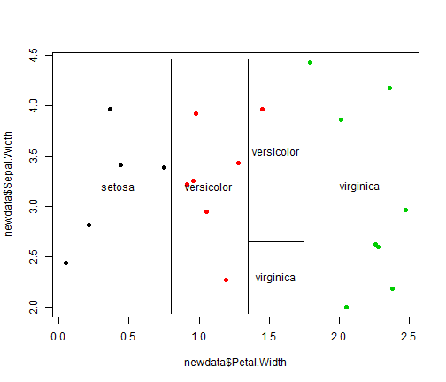
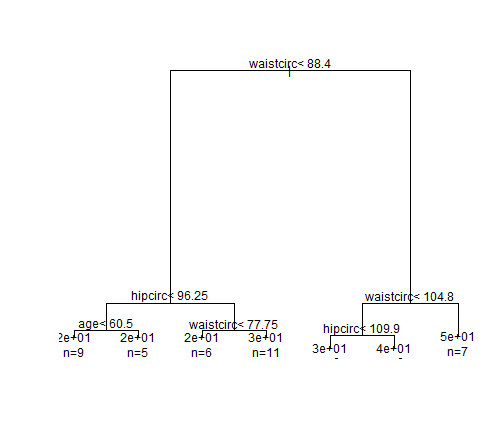
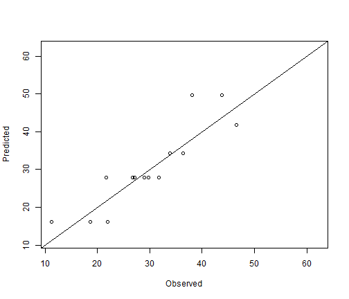

Decision Trees with Package rpart
========================================================
R & Data Mining: Examples & Case Studies Section 4.2- Yanchang Zhao
Replicated by: Brian C. Pike
========================================================

#Load Your Packages

```r
library(mboost)
```

```
## Loading required package: parallel
## Loading required package: survival
## Loading required package: splines
## This is mboost 2.2-3. See 'package?mboost' and the NEWS file
## for a complete list of changes.
## Note: The default for the computation of the degrees of freedom has changed.
##       For details see section 'Global Options' of '?bols'.
```

```r
library(rpart)
```


#Examine the Bodyfat Data

```r
data("bodyfat", package = "mboost")
dim(bodyfat)
```

```
## [1] 71 10
```

[1] 71 10

```r
attributes(bodyfat)
```

```
## $names
##  [1] "age"          "DEXfat"       "waistcirc"    "hipcirc"     
##  [5] "elbowbreadth" "kneebreadth"  "anthro3a"     "anthro3b"    
##  [9] "anthro3c"     "anthro4"     
## 
## $row.names
##  [1] "47"  "48"  "49"  "50"  "51"  "52"  "53"  "54"  "55"  "56"  "57" 
## [12] "58"  "59"  "60"  "61"  "62"  "63"  "64"  "65"  "66"  "67"  "68" 
## [23] "69"  "70"  "71"  "72"  "73"  "74"  "75"  "76"  "77"  "78"  "79" 
## [34] "80"  "81"  "82"  "83"  "84"  "85"  "86"  "87"  "88"  "89"  "90" 
## [45] "91"  "92"  "93"  "94"  "95"  "96"  "97"  "98"  "99"  "100" "101"
## [56] "102" "103" "104" "105" "106" "107" "108" "109" "110" "111" "112"
## [67] "113" "114" "115" "116" "117"
## 
## $class
## [1] "data.frame"
```


```r
bodyfat[1:5, ]
```

```
##    age DEXfat waistcirc hipcirc elbowbreadth kneebreadth anthro3a anthro3b
## 47  57  41.68     100.0   112.0          7.1         9.4     4.42     4.95
## 48  65  43.29      99.5   116.5          6.5         8.9     4.63     5.01
## 49  59  35.41      96.0   108.5          6.2         8.9     4.12     4.74
## 50  58  22.79      72.0    96.5          6.1         9.2     4.03     4.48
## 51  60  36.42      89.5   100.5          7.1        10.0     4.24     4.68
##    anthro3c anthro4
## 47     4.50    6.13
## 48     4.48    6.37
## 49     4.60    5.82
## 50     3.91    5.66
## 51     4.15    5.91
```


#Split The Data Into Training and Test Subsets

```r
set.seed(1234)
ind <- sample(2, nrow(bodyfat), replace = TRUE, prob = c(0.7, 0.3))
bodyfat.train <- bodyfat[ind == 1, ]
bodyfat.test <- bodyfat[ind == 2, ]
```


#Train a Decision Tree

```r
myFormula <- DEXfat ~ age + waistcirc + hipcirc + elbowbreadth + kneebreadth
bodyfat_rpart <- rpart(myFormula, data = bodyfat.train, control = rpart.control(minsplit = 10))
attributes(bodyfat_rpart)
```

```
## $names
##  [1] "frame"               "where"               "call"               
##  [4] "terms"               "cptable"             "method"             
##  [7] "parms"               "control"             "functions"          
## [10] "numresp"             "splits"              "variable.importance"
## [13] "y"                   "ordered"            
## 
## $xlevels
## named list()
## 
## $class
## [1] "rpart"
```


```r
print(bodyfat_rpart$cptable)
```

```
##        CP nsplit rel error xerror    xstd
## 1 0.67273      0   1.00000 1.0195 0.18724
## 2 0.09391      1   0.32727 0.4415 0.10853
## 3 0.06038      2   0.23337 0.4271 0.09363
## 4 0.03420      3   0.17299 0.3842 0.09031
## 5 0.01708      4   0.13879 0.3038 0.07296
## 6 0.01696      5   0.12170 0.2740 0.06600
## 7 0.01007      6   0.10475 0.2694 0.06614
## 8 0.01000      7   0.09468 0.2695 0.06621
```


```r
print(bodyfat_rpart)
```

```
## n= 56 
## 
## node), split, n, deviance, yval
##       * denotes terminal node
## 
##  1) root 56 7265.0000 30.95  
##    2) waistcirc< 88.4 31  960.5000 22.56  
##      4) hipcirc< 96.25 14  222.3000 18.41  
##        8) age< 60.5 9   66.8800 16.19 *
##        9) age>=60.5 5   31.2800 22.41 *
##      5) hipcirc>=96.25 17  299.6000 25.97  
##       10) waistcirc< 77.75 6   30.7300 22.32 *
##       11) waistcirc>=77.75 11  145.7000 27.96  
##         22) hipcirc< 99.5 3    0.2569 23.75 *
##         23) hipcirc>=99.5 8   72.2900 29.54 *
##    3) waistcirc>=88.4 25 1417.0000 41.35  
##      6) waistcirc< 104.8 18  330.6000 38.09  
##       12) hipcirc< 109.9 9   69.0000 34.38 *
##       13) hipcirc>=109.9 9   13.0800 41.81 *
##      7) waistcirc>=104.8 7  404.3000 49.73 *
```


#Preview The Tree


```r
plot(bodyfat_rpart)
text(bodyfat_rpart, use.n = T)
```

 


#Select the Tree with the Minumum Prediction Error- Pruning


```r
opt <- which.min(bodyfat_rpart$cptable[, "xerror"])
cp <- bodyfat_rpart$cptable[opt, "CP"]
bodyfat_prune <- prune(bodyfat_rpart, cp = cp)
print(bodyfat_prune)
```

```
## n= 56 
## 
## node), split, n, deviance, yval
##       * denotes terminal node
## 
##  1) root 56 7265.00 30.95  
##    2) waistcirc< 88.4 31  960.50 22.56  
##      4) hipcirc< 96.25 14  222.30 18.41  
##        8) age< 60.5 9   66.88 16.19 *
##        9) age>=60.5 5   31.28 22.41 *
##      5) hipcirc>=96.25 17  299.60 25.97  
##       10) waistcirc< 77.75 6   30.73 22.32 *
##       11) waistcirc>=77.75 11  145.70 27.96 *
##    3) waistcirc>=88.4 25 1417.00 41.35  
##      6) waistcirc< 104.8 18  330.60 38.09  
##       12) hipcirc< 109.9 9   69.00 34.38 *
##       13) hipcirc>=109.9 9   13.08 41.81 *
##      7) waistcirc>=104.8 7  404.30 49.73 *
```


```r
plot(bodyfat_prune)
text(bodyfat_prune, use.n = T)
```

 


#Use the Selected Tree to Make a Prediction & Compare it with the Actual Values


```r
DEXfat_pred <- predict(bodyfat_prune, newdata = bodyfat.test)
xlim <- range(bodyfat$DEXfat)
```


```r
plot(DEXfat_pred ~ DEXfat, data = bodyfat.test, xlab = "Observed", ylab = "Predicted", 
    ylim = xlim, xlim = xlim)
abline(a = 0, b = 1)
```

 

