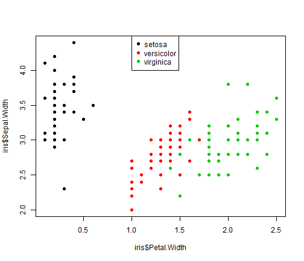
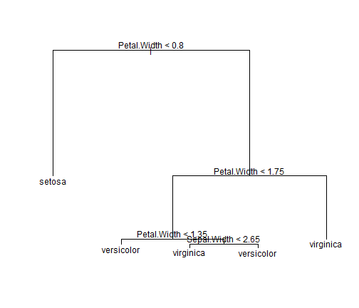
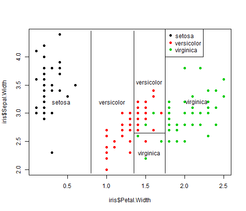
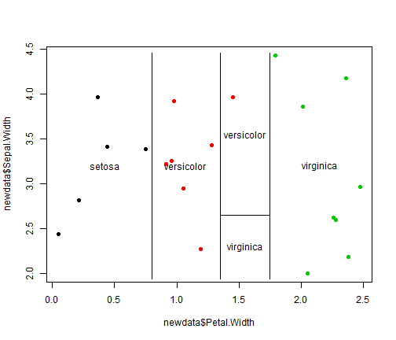
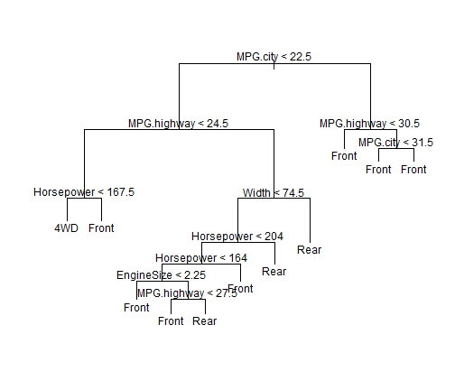
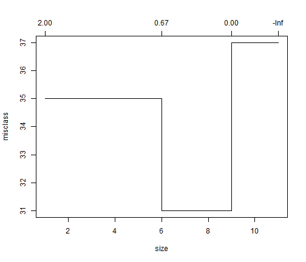
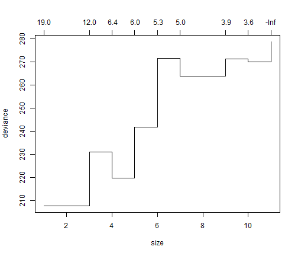
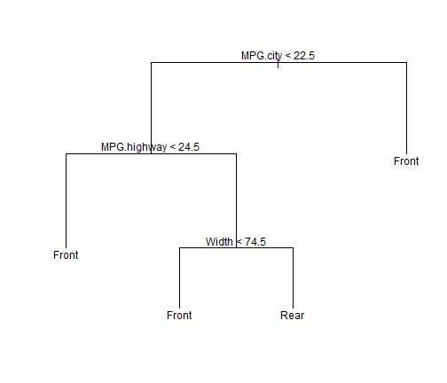

Predicting Trees
=========================================================================================
Brian C. Pike 2014 via Jeef Leek
Video Available @ https://www.youtube.com/watch?v=kdUVUINpFmI

=========================================================================================


```r
data(iris)
names(iris)
```

```
## [1] "Sepal.Length" "Sepal.Width"  "Petal.Length" "Petal.Width" 
## [5] "Species"
```


```r
table(iris$Species)
```

```
## 
##     setosa versicolor  virginica 
##         50         50         50
```


setosa versicolor  virginica 
        50         50         50 


```r
plot(iris$Petal.Width, iris$Sepal.Width, pch = 19, col = as.numeric(iris$Species))
legend(1, 4.5, legend = unique(iris$Species), col = unique(as.numeric(iris$Species)), 
    pch = 19)
```

 


#An Alternative is library(rpart)

```r
library(tree)
tree1 <- tree(Species ~ Sepal.Width + Petal.Width, data = iris)
summary(tree1)
```

```
## 
## Classification tree:
## tree(formula = Species ~ Sepal.Width + Petal.Width, data = iris)
## Number of terminal nodes:  5 
## Residual mean deviance:  0.204 = 29.6 / 145 
## Misclassification error rate: 0.0333 = 5 / 150
```


Classification tree:
tree(formula = Species ~ Sepal.Width + Petal.Width, data = iris)
Number of terminal nodes:  5 
Residual mean deviance:  0.204 = 29.57 / 145 
Misclassification error rate: 0.03333 = 5 / 150 


```r
plot(tree1)
text(tree1)
```

 


```r
plot(iris$Petal.Width, iris$Sepal.Width, pch = 19, col = as.numeric(iris$Species))
partition.tree(tree1, label = "Species", add = TRUE)
legend(1.75, 4.5, legend = unique(iris$Species), col = unique(as.numeric(iris$Species)), 
    pch = 19)
```

 


```r
set.seed(32313)
newdata <- data.frame(Petal.Width = runif(20, 0, 2.5), Sepal.Width = runif(20, 
    2, 4.5))
pred1 <- predict(tree1, newdata)
pred1
```

```
##    setosa versicolor virginica
## 1       0    0.02174   0.97826
## 2       0    0.02174   0.97826
## 3       1    0.00000   0.00000
## 4       0    1.00000   0.00000
## 5       0    0.02174   0.97826
## 6       0    0.02174   0.97826
## 7       0    0.02174   0.97826
## 8       0    0.90476   0.09524
## 9       0    1.00000   0.00000
## 10      0    0.02174   0.97826
## 11      0    1.00000   0.00000
## 12      1    0.00000   0.00000
## 13      1    0.00000   0.00000
## 14      1    0.00000   0.00000
## 15      0    0.02174   0.97826
## 16      0    0.02174   0.97826
## 17      0    1.00000   0.00000
## 18      1    0.00000   0.00000
## 19      0    1.00000   0.00000
## 20      0    1.00000   0.00000
```


setosa versicolor virginica
1       0 0.02173913 0.9782609
2       0 0.02173913 0.9782609
3       1 0.00000000 0.0000000
4       0 1.00000000 0.0000000
5       0 0.02173913 0.9782609
6       0 0.02173913 0.9782609
7       0 0.02173913 0.9782609
8       0 0.90476190 0.0952381
9       0 1.00000000 0.0000000
10      0 0.02173913 0.9782609
11      0 1.00000000 0.0000000
12      1 0.00000000 0.0000000
13      1 0.00000000 0.0000000
14      1 0.00000000 0.0000000
15      0 0.02173913 0.9782609
16      0 0.02173913 0.9782609
17      0 1.00000000 0.0000000
18      1 0.00000000 0.0000000
19      0 1.00000000 0.0000000
20      0 1.00000000 0.0000000


```r
pred1 <- predict(tree1, newdata, type = "class")
```


```r
plot(newdata$Petal.Width, newdata$Sepal.Width, col = as.numeric(pred1), pch = 19)
partition.tree(tree1, "Species", add = TRUE)
```

 


#Switching to Pruning Trees example: Cars


```r
data(Cars93, package = "MASS")
head(Cars93)
```

```
##   Manufacturer   Model    Type Min.Price Price Max.Price MPG.city
## 1        Acura Integra   Small      12.9  15.9      18.8       25
## 2        Acura  Legend Midsize      29.2  33.9      38.7       18
## 3         Audi      90 Compact      25.9  29.1      32.3       20
## 4         Audi     100 Midsize      30.8  37.7      44.6       19
## 5          BMW    535i Midsize      23.7  30.0      36.2       22
## 6        Buick Century Midsize      14.2  15.7      17.3       22
##   MPG.highway            AirBags DriveTrain Cylinders EngineSize
## 1          31               None      Front         4        1.8
## 2          25 Driver & Passenger      Front         6        3.2
## 3          26        Driver only      Front         6        2.8
## 4          26 Driver & Passenger      Front         6        2.8
## 5          30        Driver only       Rear         4        3.5
## 6          31        Driver only      Front         4        2.2
##   Horsepower  RPM Rev.per.mile Man.trans.avail Fuel.tank.capacity
## 1        140 6300         2890             Yes               13.2
## 2        200 5500         2335             Yes               18.0
## 3        172 5500         2280             Yes               16.9
## 4        172 5500         2535             Yes               21.1
## 5        208 5700         2545             Yes               21.1
## 6        110 5200         2565              No               16.4
##   Passengers Length Wheelbase Width Turn.circle Rear.seat.room
## 1          5    177       102    68          37           26.5
## 2          5    195       115    71          38           30.0
## 3          5    180       102    67          37           28.0
## 4          6    193       106    70          37           31.0
## 5          4    186       109    69          39           27.0
## 6          6    189       105    69          41           28.0
##   Luggage.room Weight  Origin          Make
## 1           11   2705 non-USA Acura Integra
## 2           15   3560 non-USA  Acura Legend
## 3           14   3375 non-USA       Audi 90
## 4           17   3405 non-USA      Audi 100
## 5           13   3640 non-USA      BMW 535i
## 6           16   2880     USA Buick Century
```


Manufacturer   Model    Type Min.Price
1        Acura Integra   Small      12.9
2        Acura  Legend Midsize      29.2
3         Audi      90 Compact      25.9
4         Audi     100 Midsize      30.8
5          BMW    535i Midsize      23.7
6        Buick Century Midsize      14.2
  Price Max.Price MPG.city MPG.highway
1  15.9      18.8       25          31
2  33.9      38.7       18          25
3  29.1      32.3       20          26
4  37.7      44.6       19          26
5  30.0      36.2       22          30
6  15.7      17.3       22          31
             AirBags DriveTrain Cylinders
1               None      Front         4
2 Driver & Passenger      Front         6
3        Driver only      Front         6
4 Driver & Passenger      Front         6
5        Driver only       Rear         4
6        Driver only      Front         4
  EngineSize Horsepower  RPM Rev.per.mile
1        1.8        140 6300         2890
2        3.2        200 5500         2335
3        2.8        172 5500         2280
4        2.8        172 5500         2535
5        3.5        208 5700         2545
6        2.2        110 5200         2565
  Man.trans.avail Fuel.tank.capacity
1             Yes               13.2
2             Yes               18.0
3             Yes               16.9
4             Yes               21.1
5             Yes               21.1
6              No               16.4
  Passengers Length Wheelbase Width
1          5    177       102    68
2          5    195       115    71
3          5    180       102    67
4          6    193       106    70
5          4    186       109    69
6          6    189       105    69
  Turn.circle Rear.seat.room Luggage.room
1          37           26.5           11
2          38           30.0           15
3          37           28.0           14
4          37           31.0           17
5          39           27.0           13
6          41           28.0           16
  Weight  Origin          Make
1   2705 non-USA Acura Integra
2   3560 non-USA  Acura Legend
3   3375 non-USA       Audi 90
4   3405 non-USA      Audi 100
5   3640 non-USA      BMW 535i
6   2880     USA Buick Century


```r
treeCars <- tree(DriveTrain ~ MPG.city + MPG.highway + AirBags + EngineSize + 
    Width + Length + Weight + Price + Cylinders + Horsepower + Wheelbase, data = Cars93)
```


```r
plot(treeCars)
text(treeCars)
```

 


#Plot Errors, Deviance and misclassification

```r
par(mfrow = c(1, 2))
```


```r
plot(cv.tree(treeCars, FUN = prune.tree, method = "misclass"))
```

 

```r
plot(cv.tree(treeCars))
```

 


#Prune the Tree

```r
pruneTree <- prune.tree(treeCars, best = 4)
```


```r
plot(pruneTree)
text(pruneTree)
```

 


#Show Resubtitition Error

```r
table(Cars93$DriveTrain, predict(pruneTree, type = "class"))
```

```
##        
##         4WD Front Rear
##   4WD     5     5    0
##   Front   1    66    0
##   Rear    1    10    5
```


 4WD Front Rear
  4WD     5     5    0
  Front   1    66    0
  Rear    1    10    5


```r
table(Cars93$DriveTrain, predict(treeCars, type = "class"))
```

```
##        
##         4WD Front Rear
##   4WD     5     5    0
##   Front   2    61    4
##   Rear    0     3   13
```


        4WD Front Rear
  4WD     5     5    0
  Front   2    61    4
  Rear    0     3   13
  
